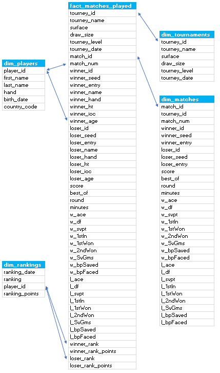

# Udacity-Capstone-Project
My Udacity Data Engineering Nanodegree Capstone Project

# Step 1: Scope the Project and Gather Data

My Project is about gathering ATP (Mens) and WTA (Womens) Tennis data including a player list, matches played, and rankings to show various types of information. 

The end solution will provide a schema which allows users to extract data on players, matches, and tournaments including matches played in 2020, match performances in a given time period, and how a player's ranking has changed over time. 

I have gathered this data from https://github.com/awesomedata/awesome-public-datasets#sports (special thanks to JeffSackmann for the data.) using both the ATP and WTA links. I will combine the datasets together. These datasets which involve both the ATP and WTA include:

- A players dataset which gathers player information 
- A rankings dataset which gathers a player's ranking over time (2020 only but room for further scope to increase dataload)
- A matches dataset which gathers match data including, who won the match, the score, player stats and which tournament the match was played in. (2020 only but room for further scope to increase dataload)

# Step 2: Explore and Assess the Data

The ATP Ranking data file had some entries which we not formatted properly so I removed it from the file. In the players file, I have separated the birth date by gathering the year, month, and day.

# Step 3: Define the Data Model

I have decided to use Apache Airflow to run data pipelines for this project. Please see the DAG Graph below:

Here is an outline of my data schema:

- Matches Played Fact Table
- Matches Dimension Table
- Players Dimension Table
- Rankings Dimension Table
- Tournaments Dimension Table

Please see the data model on how these on connect together below:

# Step 4: Run ETL to Model the Data

Please see attached Data Dictionary for the meanings of the Data columns for each Table.

# Step 5: Complete Project Write Up

The data is planned to be updated on a daily basis. I plan in the future to run the data directly from Github which will allow my DAG to run on a daily schedule to pick up any changes made to any of the data files. 

The data files are kept here: 

- ATP https://github.com/JeffSackmann/tennis_atp
- WTA https://github.com/JeffSackmann/tennis_wta

Running the data once a day is the most logical approach as matches are played on a daily basis for most Tournaments until a winner has been crowned.

If the data was increased by 100x I would separate the matches and rankings table on a yearly/monthly basis.

If the pipelines were run on a daily basis by 7am, I would use partition the matches and rankings tables to run specific dates.

If the database needed to be accessed by 100+ people I would restrict the data for all files to only the last 12 months.

